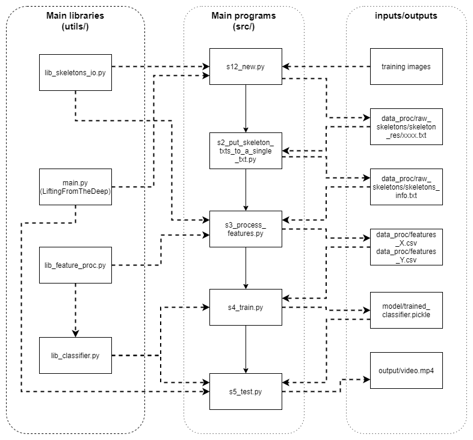

# Real-time Action Recognition Based-on Human Skeleton


**Highlights**: 
4 actions; single people; Real-time and multi-frame based recognition algorithm.   
  
This work is derived by felixchenfy/Realtime-Action-Recognition and our goal was to introduce the third dimension.


**Contents:**
- [1. Algorithm](#1-algorithm)
- [2. Install Dependency (Lifting from the Deep)](#2-install-dependency--Lifting-from-the-Deep-)
- [3. Program structure](#3-program-structure)
  * [Diagram](#diagram)
  * [Main scripts](#main-scripts)
- [4. How to run: Inference](#4-how-to-run--inference)
  * [Introduction](#introduction)
- [5. Training data](#5-training-data)
  * [Download my data](#download-my-data)
  * [Data format](#data-format)
  * [Classes](#classes)
- [6. How to run: Training](#6-how-to-run--training)
- [7. Result and Performance](#7-result-and-performance)


# 1. Algorithm


We collected videos of 4 Types of actions: `['stand', 'walk', 'sit', 'meal']`. 
We used the following dataset for training:  
*  CMU Panoptic Dataset (http://domedb.perception.cs.cmu.edu/)  
*  CAD-120 (http://pr.cs.cornell.edu/humanactivities/data.php) (3D point extracted using Lifting from the Deep: https://github.com/DenisTome/Lifting-from-the-Deep-release)   
*  Two videos (https://www.youtube.com/watch?v=rXjx5Jplfz8, https://www.youtube.com/watch?v=Jn52_g7CKx0) (3D point extracted using Lifting from the Deep: https://github.com/DenisTome/Lifting-from-the-Deep-release)

The workflow of the algorithm is:
*  Get the joints' positions (this can be done with Lifting from the Deep: https://github.com/DenisTome/Lifting-from-the-Deep-release).  
*  Fill in a person's missing joints by these joints' relative pos in previous frame.  See `class FeatureGenerator` in [lib_feature_proc.py](utils/lib_feature_proc.py). So does the following.
*  Use a window size of 5 frames to extract features.    
*  Extract features of (1) body velocity and (2) normalized joint positions and (3) joint velocities.
*  Apply PCA to reduce feature dimension to 80.  Classify by DNN of 3 layers of 50x50x50 (or switching to other classifiers in one line). See `class ClassifierOfflineTrain` in [lib_classifier.py](utils/lib_classifier.py)
*  Mean filtering the prediction scores between 2 frames. Add label above the person if the score is larger than 0.8. See `class ClassifierOnlineTest` in [lib_classifier.py](utils/lib_classifier.py)

For more details about how the features are extracted, please see my [report](https://github.com/felixchenfy/Data-Storage/blob/master/EECS-433-Pattern-Recognition/FeiyuChen_Report_EECS433.pdf).


# 2. Install Dependency (Lifting from the Deep)

First, Python >= 3.6.

we used the "Lifting from the Deep" from this Github: [Lifting-from-the-Deep](https://github.com/DenisTome/Lifting-from-the-Deep-release). First download it:

```
export MyRoot=$PWD
cd src/githubs  
git clone https://github.com/DenisTome/Lifting-from-the-Deep-release  
```
Follow its tutorial.

Please be sure that simplejson is installed. if not:

```
pip install simplejson
```

# 3. Program structure

## Diagram



Trouble shooting:
  * How to change features?

    In [utils/lib_feature_proc.py](utils/lib_feature_proc.py), in the `class FeatureGenerator`, change the function `def add_cur_skeleton`! 
    
    The function reads in a raw skeleton and outputs the feature generated from this raw skeleton as well as previous skeletons. The feature will then be saved to `features_X.csv` by the script [s3_preprocess_features.py](src/s3_preprocess_features.py) for the next training step.

  * How to include joints of the head?

    You need to change the aforementioned `add_cur_skeleton` function. 
    
    I suggest you to write a new function to extract the head features, and then append them to the returned variable(feature) of `add_cur_skeleton`.

    Please read `def retrain_only_body_joints` in `utils/lib_feature_proc.py` if you want to add the head joints.

  * How to change the classifier to RNN?

    There are two major changes to do:
    
    First, change the aforementioned `add_cur_skeleton`. Instead of manually extracing time-serials features as does by the current script, you may simply stack the input skeleton with previous skeletons and then output it.

    Second, change the `def __init__` and `def predict` function of `class ClassifierOfflineTrain` in [utils/lib_classifier.py](utils/lib_classifier.py) to add an RNN model.


## Main scripts
The 5 main scripts are under `src/`. They are named under the order of excecution:
```
src/s1_get_skeletons_from_training_imgs.py   # deprecated     
src/s12_new.py
src/s2_put_skeleton_txts_to_a_single_txt.py
src/s3_preprocess_features.py
src/s4_train.py 
src/s5_test.py  # deprecated
src/s5_test_new.py
```

The input and output of these files as well as some parameters are defined in the configuration file [config/config.yaml](config/config.yaml). I paste part of it below just to provide an intuition:

``` yaml
classes: ['sit', 'stand', 'walk', 'meal']

image_filename_format: "{:05d}.jpg"
skeleton_filename_format: "{:08d}.json"                                              #MODIFIED
 
features:
  window_size: 5 # Number of adjacent frames for extracting features. 

s1_get_skeletons_from_training_imgs.py:
  openpose:
    model: cmu # cmu or mobilenet_thin. "cmu" is more accurate but slower.
    img_size: 656x368 #  656x368, or 432x368, 336x288. Bigger is more accurate.
  input:
    images_description_txt: data/source_images3/valid_images.txt
    images_folder: data/source_images3/
  output:
    images_info_txt: data_proc/raw_skeletons/images_info.txt
    detected_skeletons_folder: &skels_folder data_proc/raw_skeletons/skeleton_res/
    viz_imgs_folders: data_proc/raw_skeletons/image_viz/

s2_put_skeleton_txts_to_a_single_txt.py:
  input:
    # A folder of skeleton txts. Each txt corresponds to one image.
    detected_skeletons_folder: *skels_folder
  output:
    # One txt containing all valid skeletons.
    all_skeletons_txt: &skels_txt data_proc/raw_skeletons/skeletons_info.txt

s3_preprocess_features.py:
  input: 
    all_skeletons_txt: *skels_txt
  output:
    processed_features: &features_x data_proc/features_X.csv
    processed_features_labels: &features_y data_proc/features_Y.csv

s4_train.py:
  input:
    processed_features: *features_x
    processed_features_labels: *features_y
  output:
    model_path: model/trained_classifier.pickle
```

For how to run the main scripts, please see the Section `4. How to run: Inference` and `6. How to run: Training`.

# 4. How to run: Inference

## Introduction
The script [src/s5_test_new.py](src/s5_test_new.py) is for doing real-time action recognition. 


The classes are set in [config/config.yaml](config/config.yaml) by the key `classes`.

The trained model is set by `--model_path`, e.g.:[model/trained_classifier.pickle](model/trained_classifier.pickle).

The output is set by `--output_folder`, e.g.: output/.

The test data (a video, and a folder of images) are already included under the [data_test/](data_test/) folder.

An example result of the input video "exercise.avi" is:

```
output
├── action.csv
└── action_stabilizzato.csv
```
Also, the video result is saved in the main folder.

Put your data in a folder in "data_test"
In [src/s5_test_new.py](src/s5_test_new.py) at line 178, 152 modufy the folder name.
In [src/s5_test_new.py](src/s5_test_new.py) at line 321 modufy the video name.


# 5. Training data


## Download my data
Follow the instructions in [dataset/readme.txt](dataset/readme.txt) to download the data. Or, you can create your own. The data and labelling format are described below.

## Data format

Each data subfolder (e.g. `dataset/.../jump_03-02-12-34-01-795/`) contains images named as `00001.jpg`, `00002.jpg`, etc.   
The naming format of each image is defined in [config/config.yaml](config/config.yaml) by the sentence: `image_filename_format: "{:05d}.jpg"`.

The images to be used as training data and their label are configured by this txt file: [src/githubs/Lable_video.txt](src/githubs/Lable_video.txt).  
A snapshot of this txt file is shown below:
```
stand, 171204_pose1, 0
12 54
63 149
stand, 171204_pose1, 1
164 186
221 296
```
In each paragraph,  
the 1st line is the data folder name, which should start with `"${class_name}_"`. 
The 2nd and following lines specify the `staring index` and `ending index` of the video that corresponds to that class.

Let's take the 1st paragraph of the above snapshot as an example: `stand` is the class, and the frames `12~54` & `63~149` of the video are used for training.

## Classes

The classes are set in [config/config.yaml](config/config.yaml) under the key word `classes`. No matter how many classes you put in the training data (set by the folder name), only the ones that match with the classes in **config.yaml** are used for training and inference.


# 6. How to run: Training

First, you may read
* Section `5. Training data`
* Section `3. Program structure`
* [config/config.yaml](config/config.yaml)

to know the training data format and the input and output of each script.

Then, follow the following steps to do the training:
* If you are using your data, change the values of `classes` and `images_description_txt` and `images_folder` inside [config/config.yaml](config/config.yaml).
* Depend on your need, you may change parameters in [config/config.yaml](config/config.yaml).
* Finally, run the following scripts one by one:
    ``` bash
    python src/s12_new.py
    python src/s2_put_skeleton_txts_to_a_single_txt.py 
    python src/s3_preprocess_features.py
    python src/s4_train.py 
    python src/s5_test_new.py
    ```

# 7. Result and Performance

The system used do not give excelent results.  
The main problem is given by the dataset used. This dataset in fact is not consistent. Except for panoptic which have 3D skeleton's information for the remaining part of the dataset we started from a 2D image and we obtained a 3D skeleton: this means that the data are not always precised.  
We have found difficulties to obtain the data we needed. In our dataset the action "walk" is less present with the respect to the other actions. This also might be a problem.  
Finally we don't take advantage of the fact that inputs frames are correlated over time. We used a simple classifier but it is better used a RNN (for example LSTM) which could increase consecutive frame correlation capabilities.  
  
How to improve:  
Improve and expand the dataset and use a rnn.

If you want read more about this project you can find our report in [doc/activity_recognition_report.pdf](doc/activity_recognition_report.pdf).
